**University:** ITMO University  
**Faculty:** [FTMI]  
**Course:** Облачные платформы как основа технологического предпринимательства  
**Year:** 2025/2026  
**Group:** U4125  
**Author:** Barvinok Vsevolod Vladimirovich  
**Lab:** Lab1  
**Date of create:** 05.05.2026  
**Date of finished:** 05.05.2026 

## Отчет по лабораторной работе "№1 "Обзор Google Cloud и исследование основных сервисов.""  
## Ход работы

### 1. Создание сервисного аккаунта
Выдали доступы к Google Cloud  
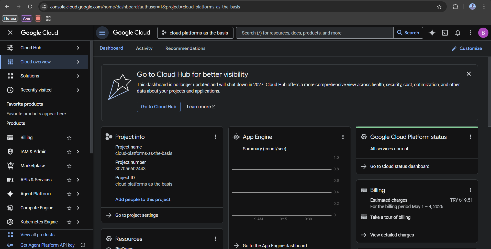  
В разделе IAM → Service accounts был создан сервисный аккаунт с именем vbarvinok-sa-lab1 и роль Storage Admin  
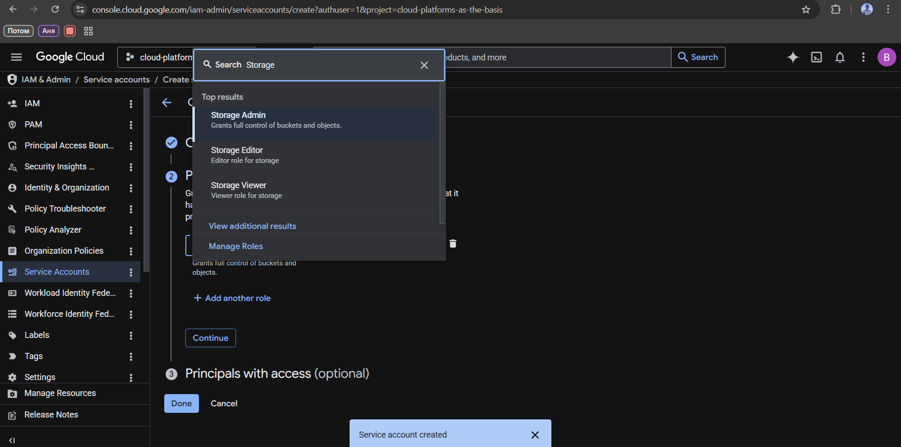  

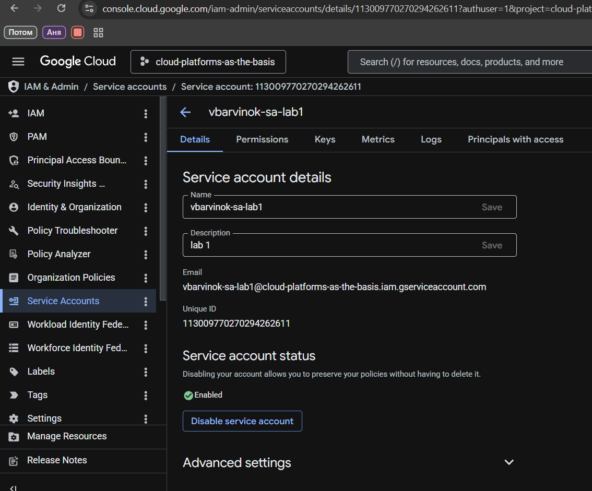

### 2. Создать минимальный compute engine (виртуальную машину)  

Создана виртуальная машина vbarvinok-vm-lab1 со следующими параметрами:  
- E2
- e2-micro
- Spot
- Привязан сервисный аккаунт vbarvinok-sa-lab1
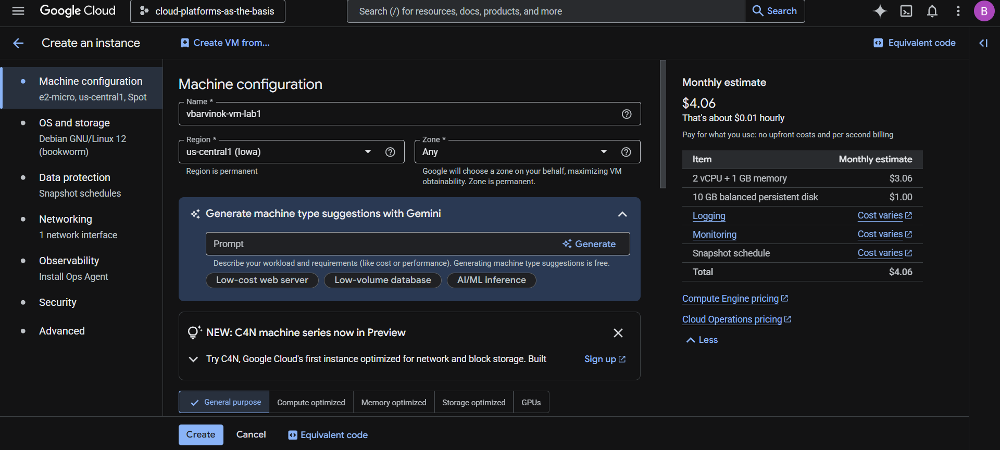
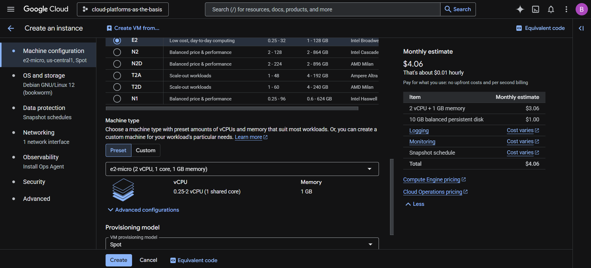
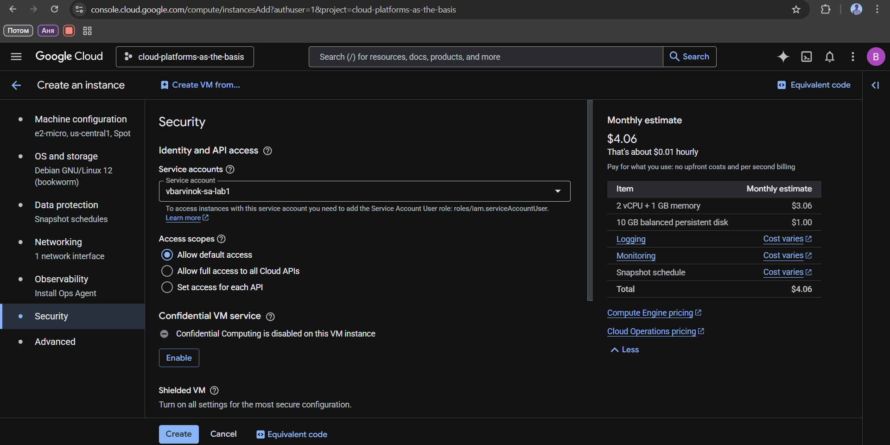

### 3. Задачи с VM
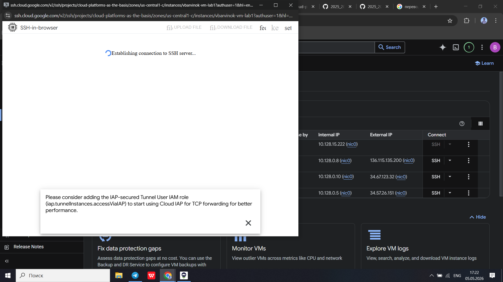
Подключившись к VM через SSH, была создана директория ~/vlab1 и выполнено копирование всех файлов из бакета lab1-bucket-itmo с помощью gcloud:
mkdir ~/vlab1  
gcloud storage cp gs://lab1-bucket-itmo/* ~/vlab1/  
ls -lah ~/vlab1/  

Операция завершилась успешно — скопированы 3 файла (pic1.jpg, pic2.jpg, pic3.jpeg).  

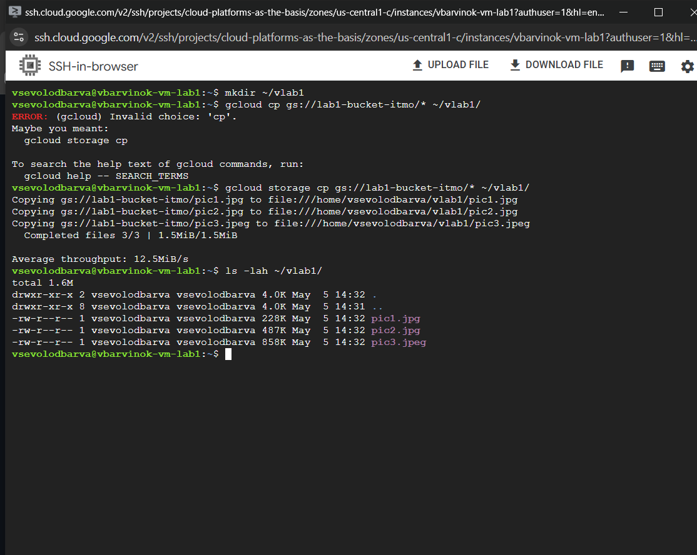  

### 4. Смена роли и результаты  
Роль сервисного аккаунта `vbarvinok-sa-lab1` должен был изменить с Storage Admin на Compute Viewer, но я случайно полностью удалил...  

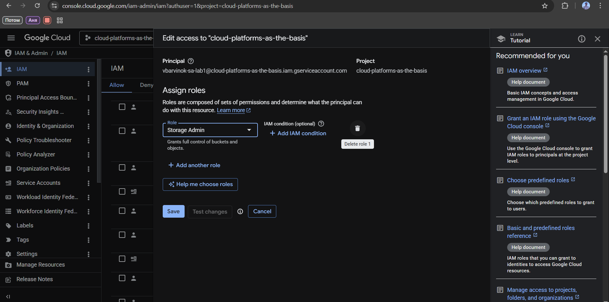
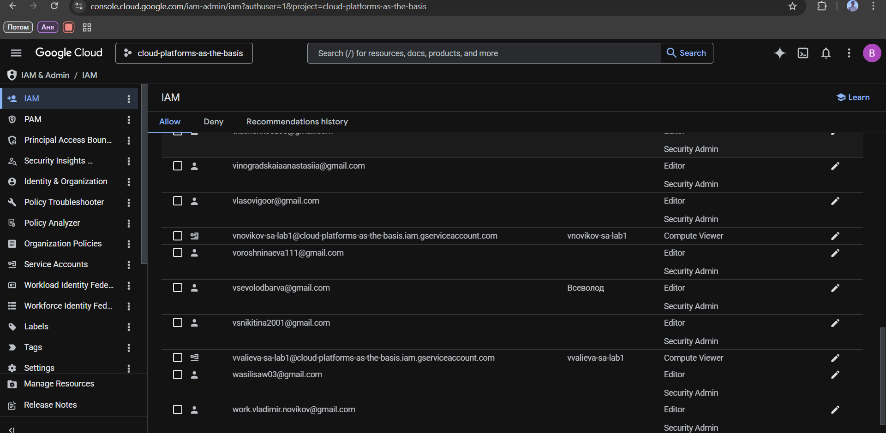

После смены нужно было сделать данные команды:  
gcloud storage cp gs://lab1-bucket-itmo/* ~/vlab/  
Результат - 403 ошибка доступа  

Далее остановил и удалил  
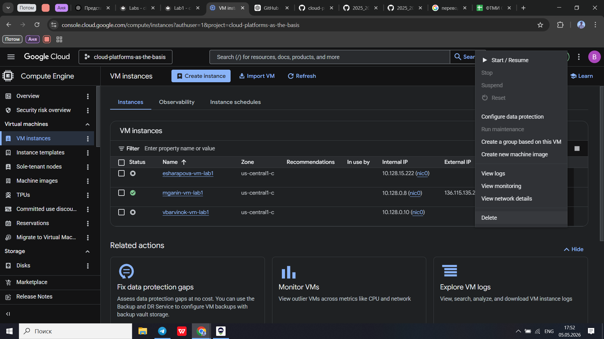  

Вывод: при смене ролей уже не будет полноценного доступа, из-за чего и будет вызываться ошибка, поэтому роли очень важны  
