**University:** ITMO University  
**Faculty:** [FTMI]  
**Course:** Облачные платформы как основа технологического предпринимательства  
**Year:** 2025/2026  
**Group:** U4125  
**Author:** Barvinok Vsevolod Vladimirovich  
**Lab:** Lab2  
**Date of create:** 05.05.2026  
**Date of finished:** 05.05.2026 

## Отчет по лабораторной работе "№2 "Исследование Cloud Run""  
## Ход работы

### 1. Создайте Cloud Run из представленного дефолтного сервиса Hello с минимальным количеством ресурсов
В консоли Google Cloud был создан новый сервис Cloud Run на основе стандартного образа us-docker.pkg.dev/cloudrun/container/hello, имя vbarvinok-hello-lab2  
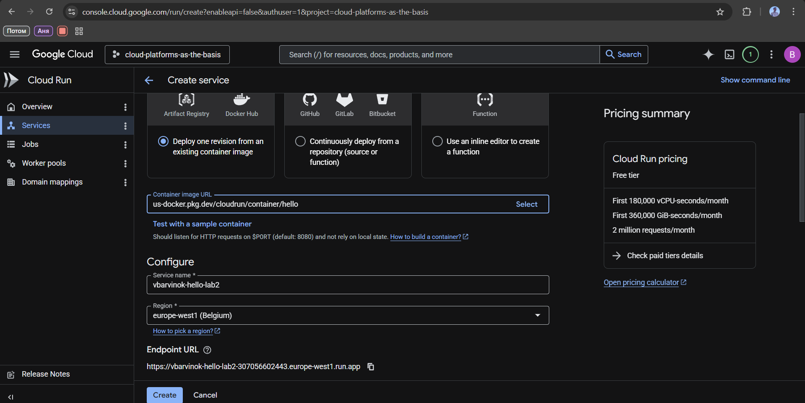  
  
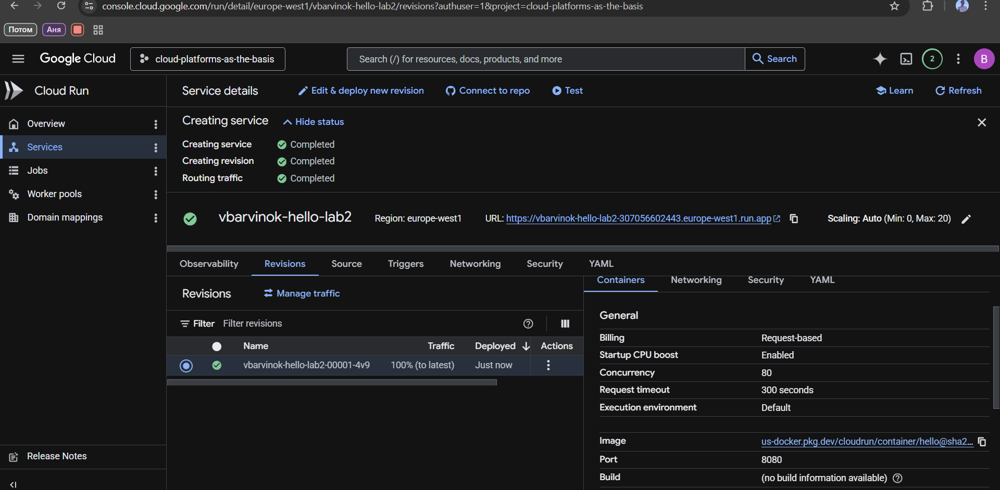  

### 2. Перейдите по ссылке предоставленной Cloud Run, протестируйте сервис  

Ссылка была такой https://vbarvinok-hello-lab2-307056602443.europe-west1.run.app  
Перешёл, всё хорошо, выдается такая картинка
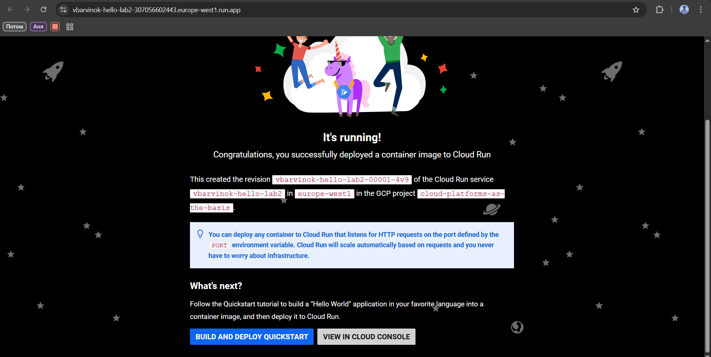

### 3. Перейдите в разделы логи и метрики, проанализируйте их
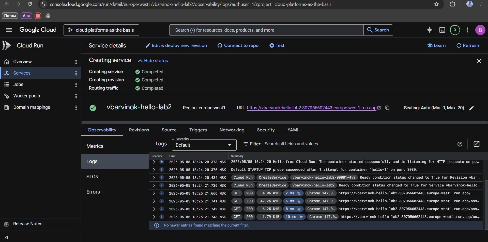  
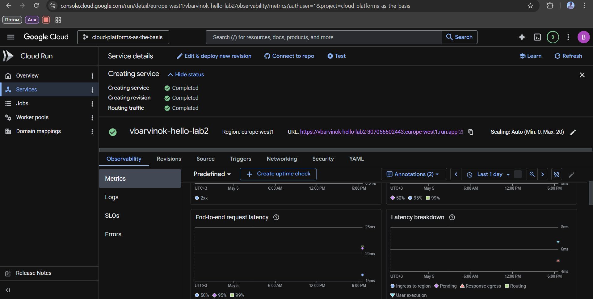  
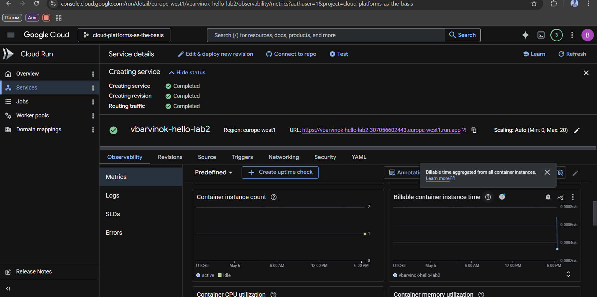  
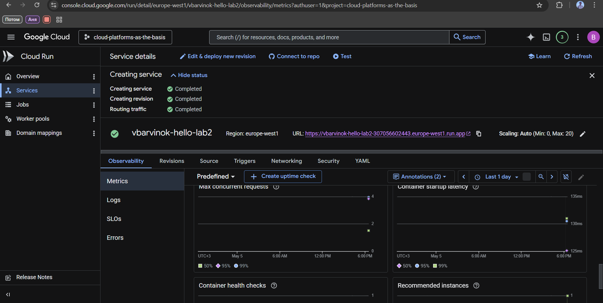  
Логи показывают мои операции, откуда я захожу (Chrome), Port и сколько ресурсов тратится

### 4. Измените ваш Cloud Run, поменяв порт на 8090, посмотрите что произойдет. Попробуйте попереключать трафик между версиями, сравните результаты работы    
Сразу опишу ситуацию, что сменил, было предупреждение о Port, ошибки не были выявлены, далее нашел функции для переключения, распределения трафика и процент мощностей

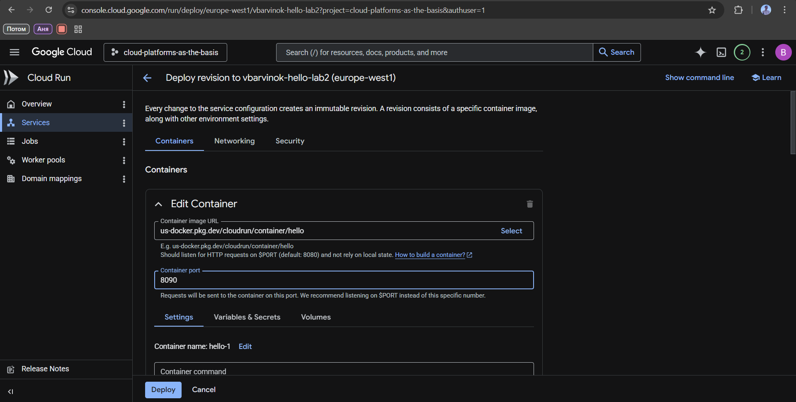
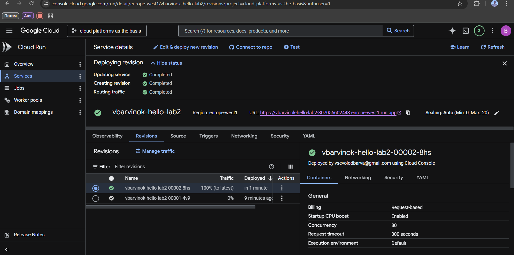
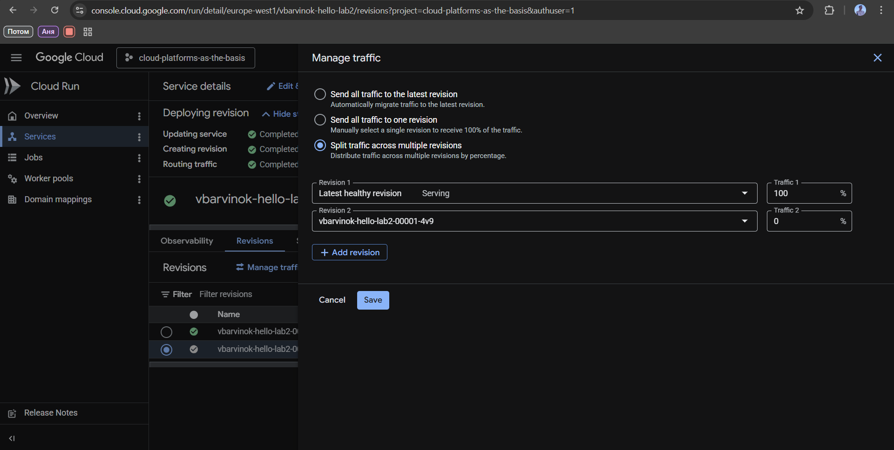
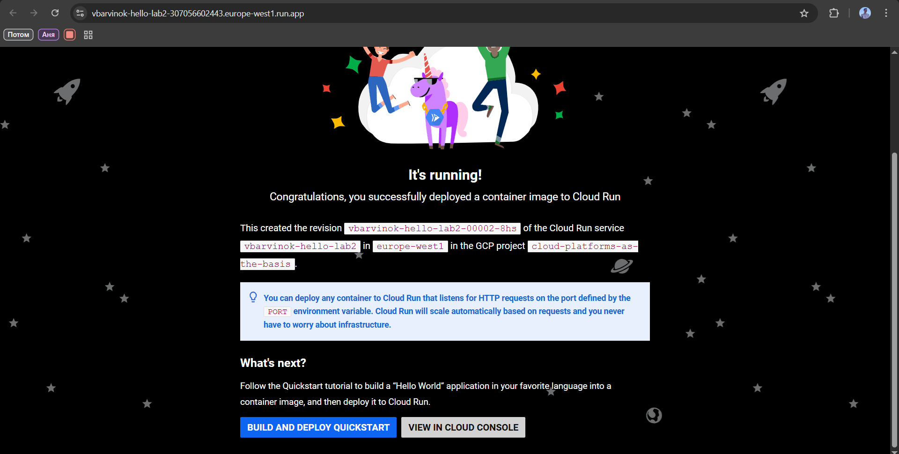
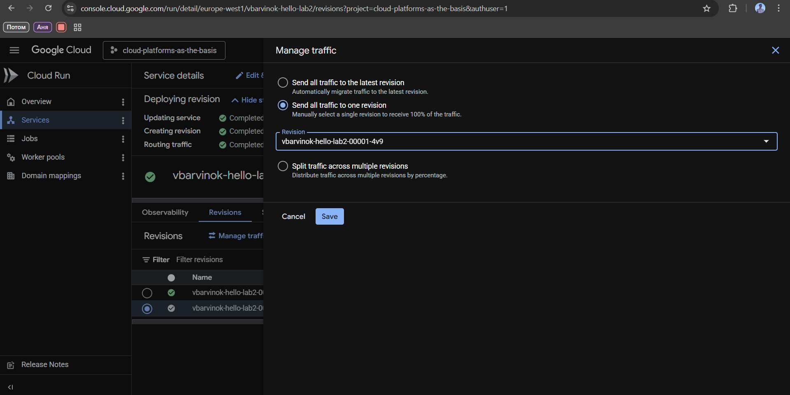
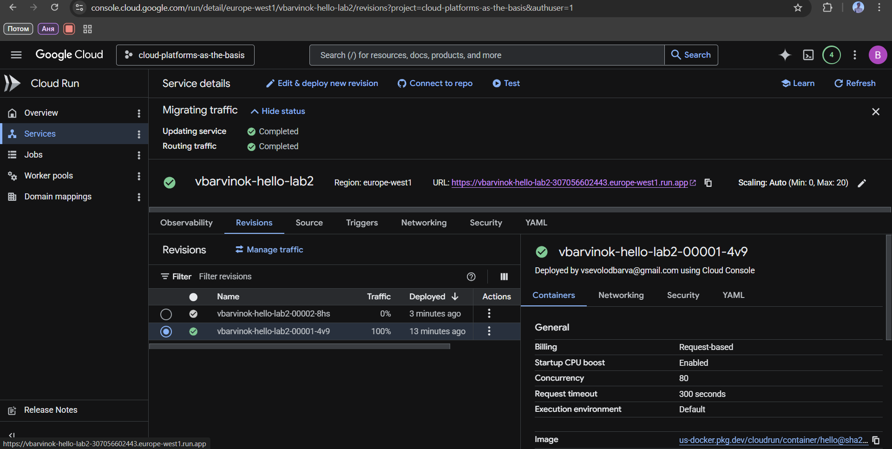
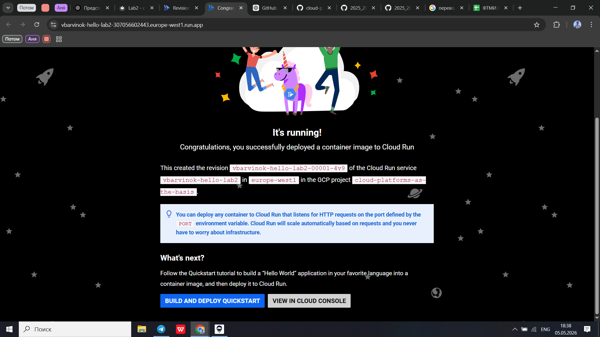

Далее удалил контейнеры    
