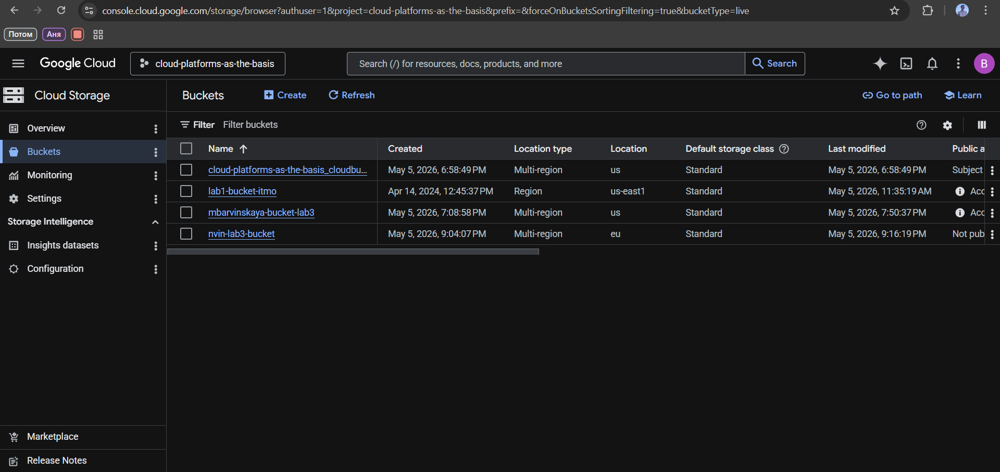
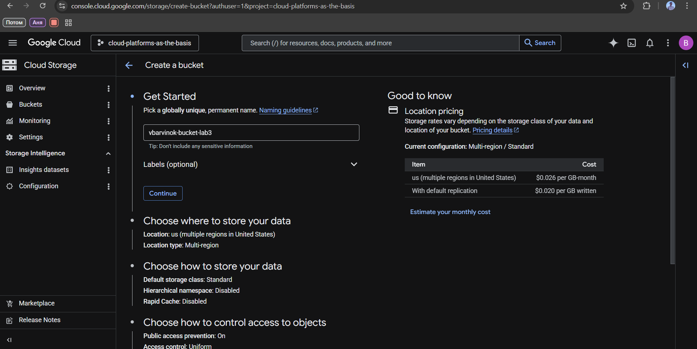
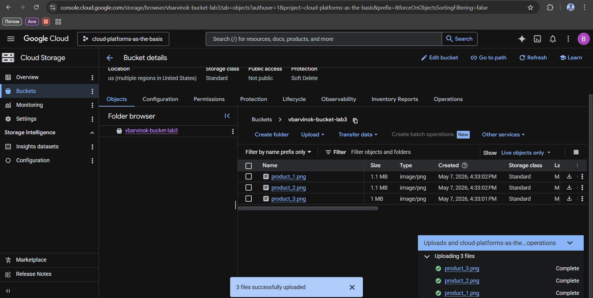
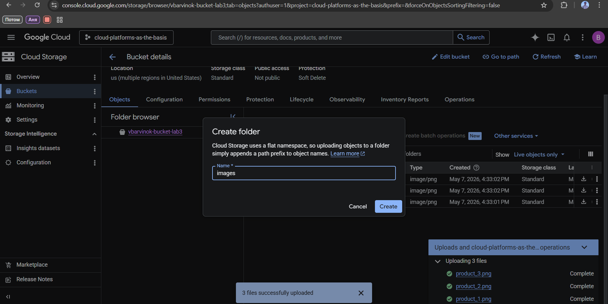
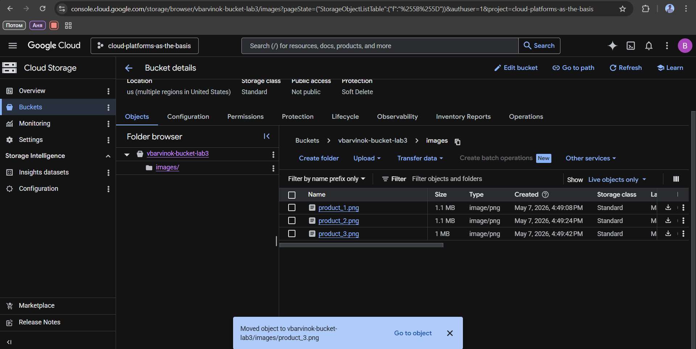
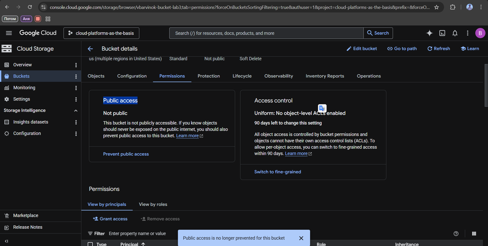
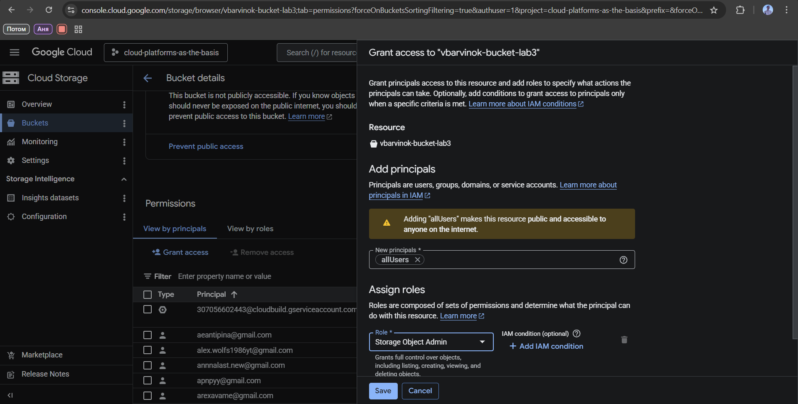
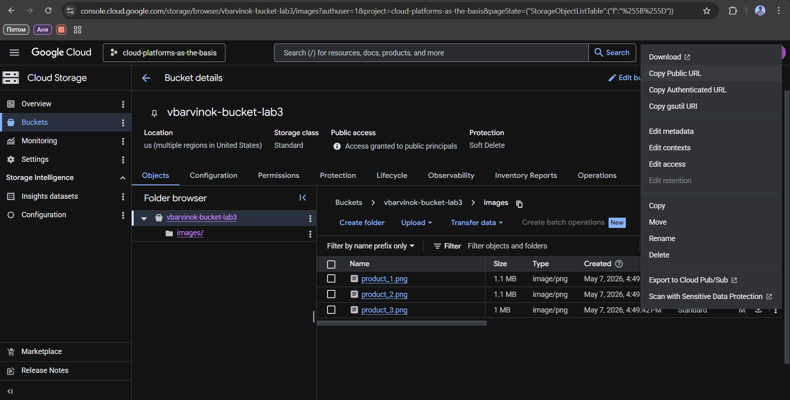

**University:** ITMO University  
**Faculty:** [FTMI]  
**Course:** Облачные платформы как основа технологического предпринимательства  
**Year:** 2025/2026  
**Group:** U4125  
**Author:** Barvinok Vsevolod Vladimirovich  
**Lab:** Lab3 
**Date of create:** 06.05.2026  
**Date of finished:** 08.05.2026 

## Отчет по лабораторной работе "№3 "Исследование Cloud Storage""  
## Ход работы

### 1. Выбрать существующий проект, в котором у вас есть соответствующие разрешения
В качестве проекта выбрала учебный «cloud-platforms-as-the-basis»  
   

### 2. Создать Cloud Storage bucket  
  

### 3. Загрузить 3-4 любых изображения в Cloud Storage bucket  
Был создан бакет vbarvinok-bucket-lab3. После создания бакета в него были загружены три изображения
  

### 4. Создать папку с любым названием и переместить файлы туда в пределах бакета    
Назвал папку images, переместил 3 файал через Move
   
   

### 5. Настроить публичный доступ для ваших файлов в настройках приватности   
Permissions → Public access + Grant Access → AllUsers + Storage Object Admin
   
   
### 6. Создать ссылку на ваши файлы через контекстное меню файла
Public access Access granted to public principals → Copy Public URL https://storage.googleapis.com/vbarvinok-bucket-lab3/images/product_1.png  
 

По ссылке файл и правда открывался
   
