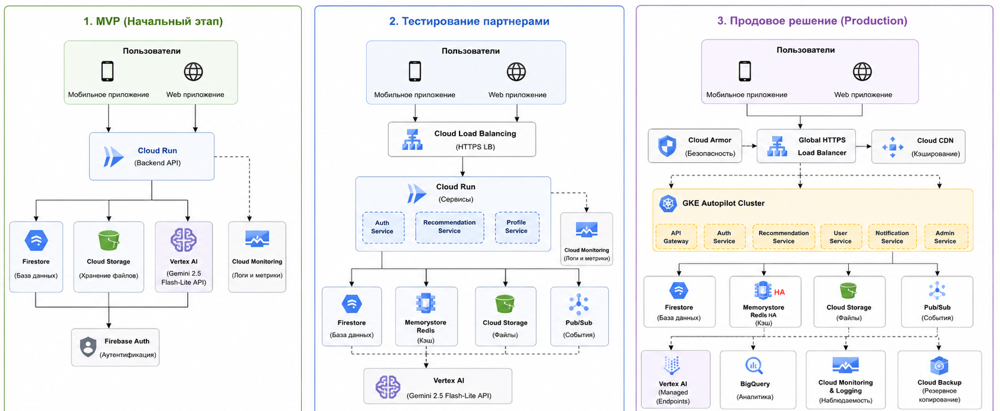

**University:** ITMO University  
**Faculty:** [FTMI]  
**Course:** Облачные платформы как основа технологического предпринимательства  
**Year:** 2025/2026  
**Group:** U4125  
**Author:** Barvinok Vsevolod Vladimirovich  
**Lab:** Lab4  
**Date of create:** 07.05.2026  
**Date of finished:** 08.05.2026 

## Отчет по лабораторной работе "№4 "Разработка инфраструктуры MVP AI приложения""  
## Ход работы

### 1. Создать прототип AI-приложения с базовой функциональностью
Приложение: прототип AI-приложения с отслеживанием состояния человека (эмоциональное, ментальное и физическое по некоторым параметрам) и предоставление рекомендаций на основе базы знаний  
AI-компонент: именно предоставление рекомендаций на основе базы знаний и, возможно, собирающихся актуальных данных  
  
Функциональные вероятные модули:
Frontend (что видно): анкета состояния, кнопки выставления эмоций, экран выдачи рекомендаций по запросу, история (? - возможно сократит затраты на выдачу рекомендаций)  
Backend (что стоит за этим): обработка запросов, логика запросов, маршрутизация  
AI: анализ ответов, базы знаний и генерация рекомендаций  
База знаний: правила, статьи, шаблоны советов (собраны заранее)  
Уведомления: напоминания (поставить эмоции за день, написать заметки и остальное для сбора данных) и подписки/какое количество человек используют  
Админ-панель: управление контентом (рассылки) и пользователями (доступы, выдача токенов, отслеживание вопросов)  
Monitoring / Logging / Alerting: контроль качества платформы и отслеживание её состояния  
  
## Ожидаемые нагрузки  
Стадия 1 - Начальное (MVP): до 100 пользователей  
Стадия 2 - Тестирование партнерами: до 5 000 пользователей  
Стадия 3 - Продовое решение: рост до массовой нагрузки  
Почему так: мы так пытались делать в реальном проекте, а у нас не было IT-специалистов, который бы подсказал, как лучше... но и для учебных гипотез это показательно   

## Этапы и расчеты
**Стадия 1 - Начальное (MVP)**  
Здесь нужна минимальная стоимость и максимально быстрый запуск. Я размышлял, может это как-то с Cloud связать и получилось это: Cloud Run подходит для serverless-запуска и биллинга по факту использования; у него есть бесплатный слой на запросы и вычисления. Cloud Storage тоже дает бесплатный тест-доступ (Free Tier), а Cloud SQL тарифицируется по CPU, памяти, storage, региону и сетевым параметрам  

Инфраструктура:
Cloud Run - 0,5 vCPU, 512 MB - Serverless-инфраструктура, оплата только за запросы  
Vertex AI (Gemini 2,5 Flash-Lite) - API access - Нет необходимости в GPU и собственном ML-кластере  
Cloud SQL PostgreSQL - db-f1-micro - Минимальная управляемая БД   
Cloud Storage - ~5 GB - Хранение медиа, логов и базы знаний  
Cloud Monitoring - Free tier - Базовые логи и мониторинг  
Firebase Authentication - Free tier - Быстрая авторизация пользователей  

Стоимость приблизительная:  
Cloud Run ~$0-1  
Vertex AI ~$0.30  
Firestore ~$0  
Cloud Storage ~$0  
Vertex AI ~$0.30  
Cloud SQL ~$9  
Monitoring ~$0–1  
Auth $0  
Итого ~$12/мес (Vertex AI на 1 пользователя)  

**Стадия 2 - Тестирование партнерами**
Что добавляем:Cloud CDN, Cloud Load Balancing, Memorystore for Redis, Pub/Sub, улучшаем Vertex AI и другие переходы с бесплатнх версий  

Инфраструктура:  
Cloud Run - 2 instances max - Рост нагрузки и разделение сервисов  
Cloud SQL PostgreSQL - 2 vCPU, 8 GB RAM - Повышение производительности БД    
Memorystore Redis - Basic tier, 1 GB - Кэширование рекомендаций и сессий  
Cloud Load Balancing - HTTPS LB - Балансировка трафика  
Cloud CDN - Standard - Ускорение загрузки статики  
Pub/Sub - Standard tier - Асинхронная обработка событий  
Vertex AI - Gemini Flash-Lite API - AI-анализ состояния  
Cloud Monitoring - Standard - Расширенный мониторинг  
  
Стоимость приблизительная:    
Cloud Run	~$10  
Cloud SQL	~$60  
Redis	~$35  
Load Balancer	~$18  
CDN	~$10  
Vertex AI	~$15  
Pub/Sub	~$5  
Storage	~$3  
Monitoring ~$10  
Итого	~$160–180/мес  

**Стадия 3 - Продовое решение**  
Здесь упомяну, что следил за проектами более квалифицированных специалистов. Самое главное изменение: GKE Autopilot - это управляет инфраструктурой, что поможет легче следить за целесообразностью проекта в дальнейшем  
  
Инфраструктура:  
GKE Autopilot - Production orchestration  
Cloud SQL - 4 vCPU, 16 GB RAM - Высокая доступность  
Memorystore Redis - Standard tier, 5 GB - Отказоустойчивый кэш  
Cloud Storage - 1 TB - Хранение пользовательских данных  
Cloud CDN - Global - Быстрая доставка контента  
Cloud Load Balancing - Global HTTPS LB - Балансировка нагрузки  
Cloud Armor - Защита от DDoS  
Vertex AI - Production AI inference  
Pub/Sub - Standard tier - Event-driven architecture  
Monitoring + Logging - Premium - Полный стек наблюдаемости  
BigQuery + Looker - Standard - BI и аналитика  
  
Стоимость приблизительная:   
GKE Autopilot	~$120 (по другой информации 600)  
Cloud SQL HA	~$350  
Redis HA	~$120  
Load Balancer	~$25  
CDN	~$60  
Cloud Armor	~$200  
Vertex AI	~$250  
Pub/Sub	~$20  
Storage	~$30  
Monitoring	~$80  
BigQuery + Looker	~$70  
Итого	~$1300–1500/мес  
Здесь уточню, что мог не всё взять + другие расценки, которые тяжело просчитать через https://cloud.google.com/products/calculator  
К тому же, может быть есть какие-то решения с Cloud Run вместо GKE, но пока не будет рассматриваться, конечный вариант решил такой сделать

## Схема инфраструктуры  
   
Здесь доверился LLM-модели, которая дополнила схему инфраструктуры некоторыми допсловами для полноценного описания. Однако упомяну тут, что вместо приложения - ссылка, так более правильно сказать на всех этапах

## Вывод  
Пытался сделать постепенную инфраструктуру. На этапе MVP используется архитектура, минимизирующая постоянные расходы и позволяющая быстро проверить продуктовую гипотезу за самые дешевые ресурсы. На стадии партнерского тестирования инфраструктура расширяется за счет балансировки нагрузки, кэширования и асинхронной обработки событий. Production-среда строится на высокодоступных сервисах, что обеспечивает масштабируемость, безопасность и устойчивость системы при высоких нагрузках. Таким образом, поэтапный подход позволяет избежать преждевременных затрат на сложную инфраструктуру и одновременно подготовить систему к дальнейшему росту продукта  

Изначально думал над тем, может вместо Cloud развернуть Telegram-бот с API системой, однако придерживаемся текущей дисциплины про облачное хранилище
